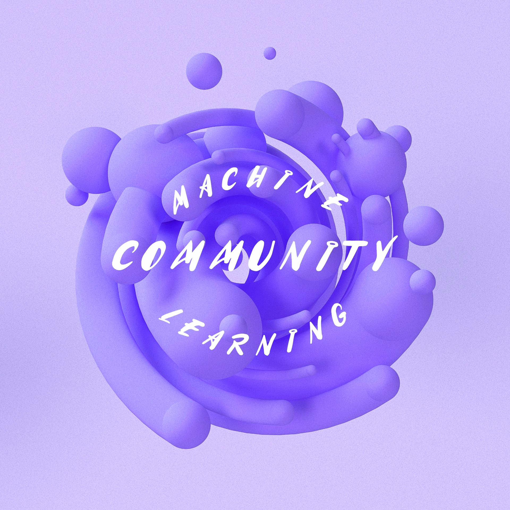

# Machine learning training 

Welcome to the machine learning training repository! This repository is designed to practice and learn basic concepts and methods in machine learning, currently derived from the writings of Professor ***Martha White*** and Professor ***Predrag Radivojac***. Interesting content is included here from various sources, but currently the main references are `Machine Learning Handbook` and `Basic of Machine Learning`.

# 
 

## Goals

1. **Practical Demonstration and Visualization**: The goal is to demonstrate the material learned practically and provide visualization to increase understanding. Converting mathematical concepts to code should be accessible and understandable. It includes simple and practical code examples to facilitate the learning experience.

2. **Translation and explanation to persian**: Another goal is to translate and explain the contents and references in Persian language. The content presented will be available in both languages and we plan to continue translating as we progress.

## Motivation

The motivation to summarize and convert content into code comes from our own experiences. Most of us, when we start machine learning, understanding the transfer of mathematical theories to practical coding seems challenging and time-consuming. It's supposed to be here by providing simple code examples that make learning less difficult, and cool examples that visualize the data distribution process and enable others to jump into the exciting aspects of machine learning early, while also learning the content behind it. they understand

The motivation to translate the content into persian is rooted in the sense of responsibility to share the exciting and recent developments in the field of machine learning. Language should not be a barrier to acquiring knowledge. Machine learning is a fascinating field, and we believe that language should not limit one's ability to stay up-to-date on today's science and technology and engage with fascinating problems.

## Community participation

We invite you to join this community! Let's work together to more effectively share interesting and groundbreaking insights with the world. We walk in this world in the realm of possibilities and impossibilities, a small help from you may have a big impact on the future of another person and make the world a more beautiful place. Let's build a society that is curious and continuous learning. to include

A lot of effort has been made to ensure the accuracy of the contents, but collective wisdom always does this better, your ideas and opinions are definitely welcome! If you find any mistakes or have any suggestions for improvement, please share. This work helps to improve a part of the world, maybe the whole world!

# 🚀 Let's go
 
